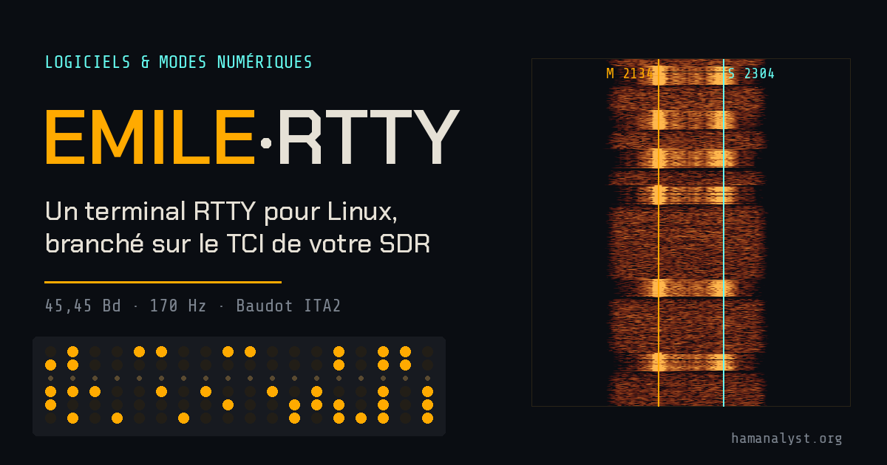
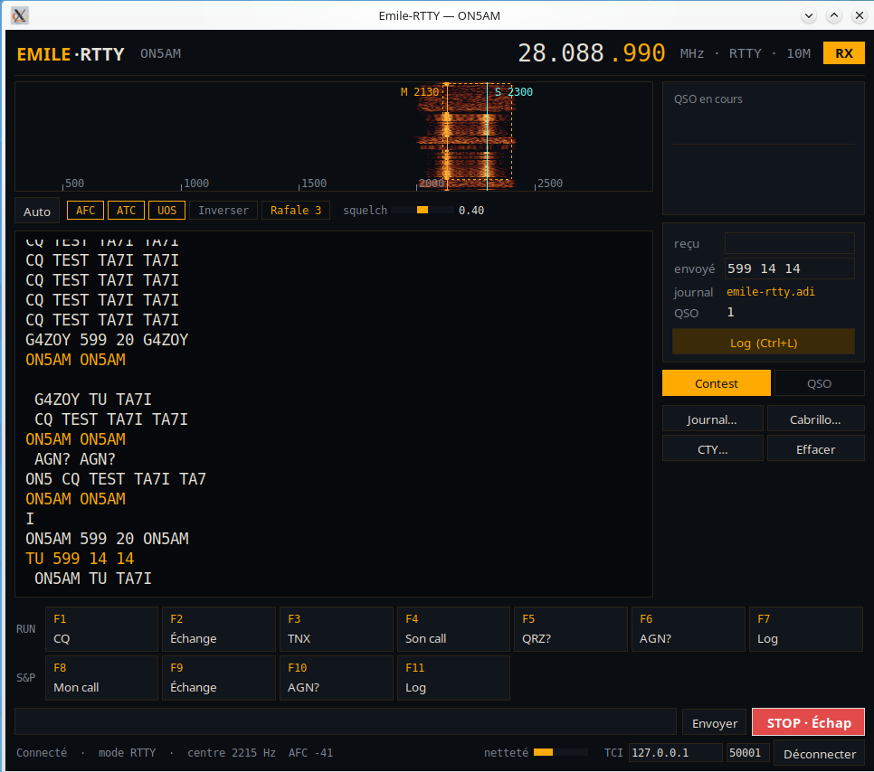

# Emile-RTTY

**Terminal RTTY pour Linux, branché sur le serveur TCI de votre SDR.**
Réception, émission, macros de contest, journal ADIF, export Cabrillo et fichier pays cty.dat, dans un seul fichier Python.

Le nom rend hommage à Émile Baudot, dont le code télégraphique à cinq éléments (1874) est l'ancêtre de l'ITA2 utilisé en RTTY.

> 🇬🇧 *English summary at the end of this page.*



L'histoire complète du projet, de l'enregistrement du premier signal au premier QSO, est racontée sur hamanalyst.org :
**[Emile-RTTY : j'ai écrit mon propre terminal RTTY pour Linux, branché sur le TCI](https://hamanalyst.org/emile-rtty-terminal-rtty-linux-tci/)**

## Fonctionnalités

**Réception**
- RTTY amateur standard : 45,45 bauds, shift 170 Hz, Baudot ITA2, unshift-on-space (UOS)
- Démodulateur non cohérent avec filtre adapté au débit (≈3 dB de mieux qu'un passe-bas classique)
- ATC « optimale » (Kok Chen, W7AY) contre le fading sélectif
- Squelch par netteté des caractères et filtre « rafale » contre les parasites isolés
- AFC ±60 Hz ancrée sur la fréquence choisie, pensée pour les appelants décalés d'un pile-up
- Polarité automatique selon le mode du transceiver (RTTY/DIGL : normal, DIGU/USB : inversé)
- Cascade (waterfall) avec calage d'un clic ou recherche automatique du signal

**Émission**
- Audio AFSK envoyé par le TCI (`trx:0,true,tci`, synchronisé sur les trames TX_CHRONO du serveur)
- Phase continue, transitions adoucies et rampes d'amplitude : signal propre et étroit
- Arrêt immédiat par STOP ou Échap, coupure de sécurité après 60 s

**Trafic et contest**
- Deux jeux de macros, *Contest* et *QSO*, en lignes RUN et S&P, sur les touches F1 à F12
- Variables `{MOI}` `{DX}` `{ECH}` `{RST}` `{NOM}` `{QTH}` ; `{LOG}` enregistre le QSO
- Macros modifiables d'un clic droit
- Journal ADIF choisi au lancement (un par concours, un pour le trafic courant)
- Export Cabrillo avec en-tête mémorisé
- Fichier pays cty.dat (AD1C) : pays, zone CQ, continent, zone reçue préremplie
- Signalement des doublons et des nouveaux multiplicateurs (pays et zone) par bande
- Double-clic sur un indicatif reçu pour le prendre comme correspondant

## Installation

Testé sous Ubuntu avec AetherSDR et un FlexRadio 6500. Tout logiciel SDR qui propose un serveur TCI devrait convenir (ExpertSDR, Thetis…) : vos retours sont les bienvenus.

Python 3.11 ou plus récent est nécessaire.

```bash
sudo apt install python3-tk python3-numpy python3-websockets
git clone https://github.com/albertM-hub/Emile-RTTY.git
cd Emile-RTTY
python3 emile_rtty.py
```

Autre possibilité pour numpy et websockets : `pip install -r requirements.txt` (tkinter vient toujours de la distribution).

Options de ligne de commande :

```bash
python3 emile_rtty.py --host 192.168.1.10 --port 50001   # serveur TCI distant
python3 emile_rtty.py --indicatif ON4XYZ --echange "599 14 14"
```

## Premier lancement

1. La fenêtre **Station** demande votre indicatif, votre prénom, votre QTH et votre échange de contest. Tant que l'indicatif n'est pas réglé, l'émission est refusée.
2. Choisissez ensuite le **journal ADIF** : un fichier existant (les QSO s'ajoutent à la suite) ou un nouveau nom.
3. Vérifiez l'adresse et le port TCI en bas à droite, puis cliquez sur **Connecter**.
4. Cliquez sur le signal dans la cascade, ou sur **Auto**.

Pour les informations pays, téléchargez le cty.dat d'AD1C sur [country-files.com](https://www.country-files.com/) et déposez-le dans `~/.config/emile-rtty/`. À défaut, Emile-RTTY utilise celui de WSJT-X s'il est installé. Le bouton **CTY…** permet d'en choisir un autre.

Pour vos premiers essais en émission : faible puissance, charge fictive ou antenne accordée, et un œil sur l'ALC.

## Utilisation

| Commande | Action |
|---|---|
| Clic dans la cascade | Centre le décodeur sur le signal |
| F1 … F12 | Macros du jeu actif (Contest ou QSO) |
| Clic droit sur une macro | Modifier son nom et son texte |
| Double-clic sur un indicatif reçu | Le placer dans « QSO en cours » |
| Ctrl+L | Enregistrer le QSO dans le journal |
| Échap | Arrêter l'émission |

**Réglages du décodeur** : AFC, ATC, UOS et Inverser s'allument ou s'éteignent d'un clic. « Rafale » fixe le nombre de caractères consécutifs exigés avant d'afficher (1 = filtre coupé). Le squelch va de 0 (tout passe) à 0,8 (très strict) ; 0,40 convient dans la plupart des cas.

**Concours** : le bouton **Cabrillo…** produit le fichier `.log` à envoyer à l'organisateur, à partir du journal ouvert. Pensez aux délais : 5 jours après la fin pour les concours CQ.

La zone reçue préremplie depuis le cty.dat ne remplace pas ce que vous avez réellement copié. Corrigez-la avant d'enregistrer si la station envoie autre chose.

## Fichiers

| Fichier | Rôle |
|---|---|
| `emile_rtty.py` | Le programme |
| `outils/tci_record.py` | Enregistre l'audio TCI dans un WAV et repère les paires de tons à 170 Hz |
| `outils/rtty_decode.py` | Décode un WAV hors ligne, pratique pour tester le démodulateur |
| `~/.config/emile-rtty/config.json` | Réglages, macros et en-tête Cabrillo (créé automatiquement) |

## Licence

Emile-RTTY est un logiciel libre distribué sous licence **GNU GPL version 3**. Voir le fichier [LICENSE](LICENSE).

© 2026 Albert Müller, ON5AM — [hamanalyst.org](https://hamanalyst.org)

---

## English summary

**Emile-RTTY** is a free RTTY terminal for Linux that connects to the **TCI server** of your SDR software (tested with AetherSDR and a FlexRadio 6500). It is a single Python file.

- **Receive**: 45.45 baud / 170 Hz / ITA2, matched filter, W7AY optimal ATC against selective fading, squelch and burst filter against noise, ±60 Hz AFC for off-frequency callers, waterfall display.
- **Transmit**: AFSK audio over TCI, clean phase-continuous signal, STOP/Esc.
- **Operating**: Contest and QSO macro sets (RUN and S&P, F1–F12), ADIF log, Cabrillo export, AD1C cty.dat support with dupe and new-multiplier flags.

```bash
sudo apt install python3-tk python3-numpy python3-websockets
python3 emile_rtty.py
```

On first start, enter your callsign in the **Station** window (transmitting is blocked until you do), then choose an ADIF log file. The user interface is in French; macros are fully editable (right-click). Feedback with other TCI software and transceivers is welcome.

73 de ON5AM
